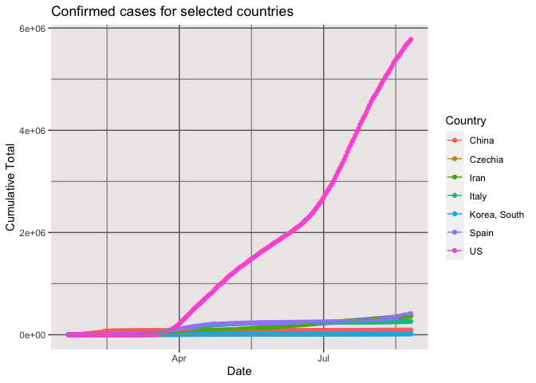

COVID-19 Confirmed Cases
================
[Jim Tyhurst, Ph.D.](https://www.jimtyhurst.com/)
2020-05-27

  - [tl;dr](#tldr)

[Source code](./covid19_confirmed_cases.Rmd).

## tl;dr

Plots cumulative number of confirmed cases for a few selected countries.
It is easy to tell by the shape of the curve whether the daily number of
cases are increasing vs countries where the rate of new infections has
decreased.

<!-- -->
