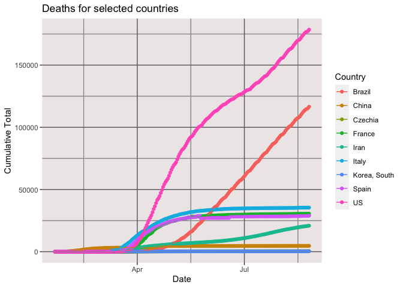

COVID-19 Deaths
================
[Jim Tyhurst, Ph.D.](https://www.jimtyhurst.com/)
2020-03-29

  - [tl;dr](#tldr)

[Source code](./covid19_deaths.Rmd).

## tl;dr

Plots cumulative number of deaths in China, Italy, Iran, Spain, South
Korea, and United States. New cases have already leveled off in China
and South Korea, but new cases are still increasing in the other
countries.

<!-- -->
