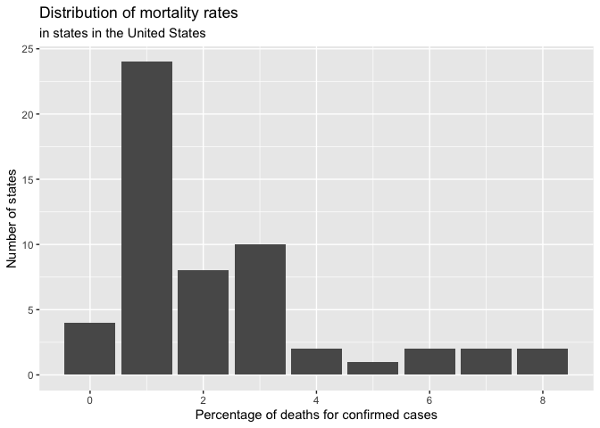

COVID-19 Deaths by State
================
[Jim Tyhurst, Ph.D.](https://www.jimtyhurst.com/)
2020-03-29

  - [Read data](#read-data)
  - [Cases by state](#cases-by-state)
  - [Deaths by state](#deaths-by-state)
  - [Mortality by state](#mortality-by-state)
  - [Distribution of mortality rates](#distribution-of-mortality-rates)

[Source code](./covid19_deaths_by_state.Rmd).

## Read data

## Cases by state

Plot of cumulative number of cases by state in the United States for a
few select states.

<!-- -->

## Deaths by state

Plot of quantity of deaths per state in the United States for a few
select states.

<!-- -->

## Mortality by state

Plot of percentage of deaths per state, calculated as (deaths / cases)
\* 100.

<!-- -->

## Distribution of mortality rates

Plot of mortality rates across states, i.e. percentage of deaths for
confirmed cases, in the United States.

<!-- -->
