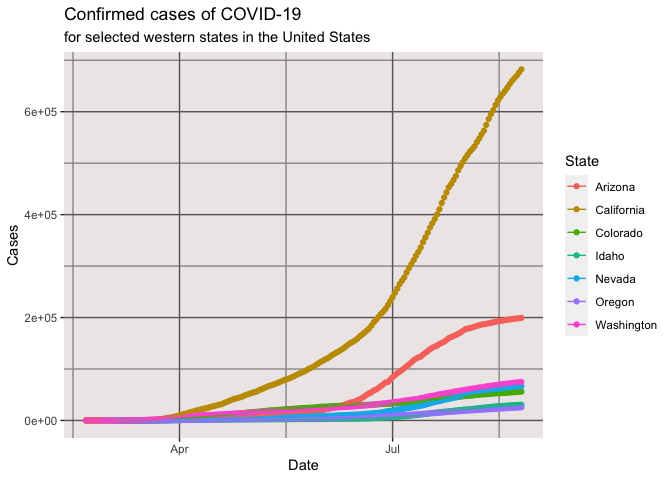
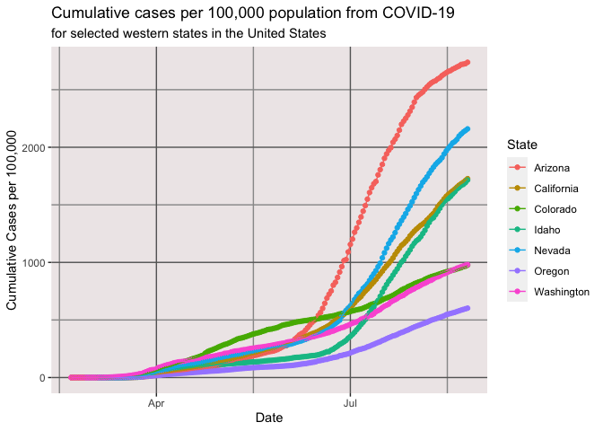
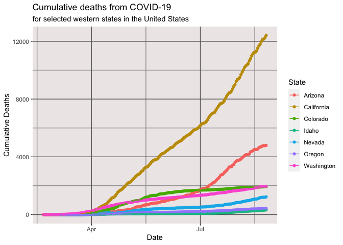
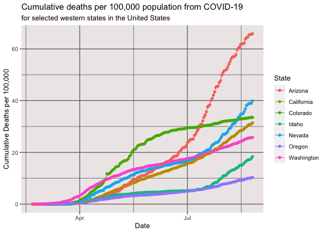
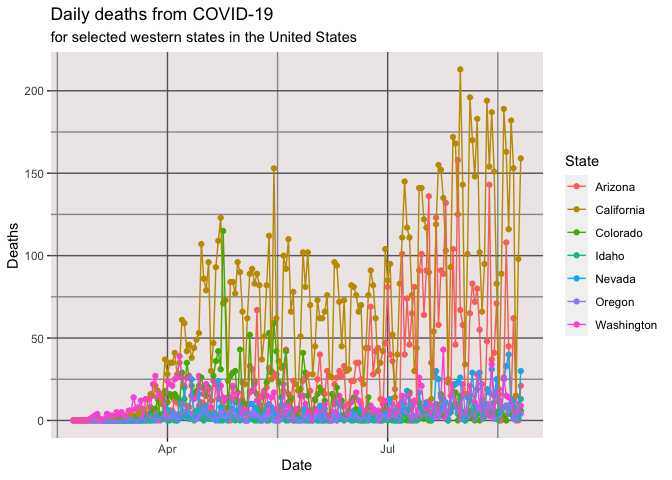
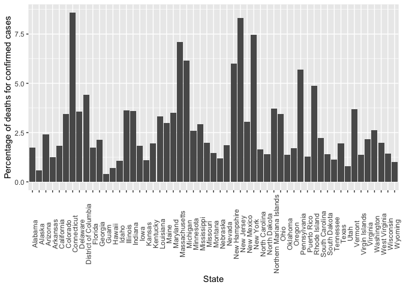

COVID-19 Deaths by State
================
[Jim Tyhurst, Ph.D.](https://www.jimtyhurst.com/)
2020-05-27

  - [Read data](#read-data)
  - [Cases by state](#cases-by-state)
      - [Cumulative number of cases](#cumulative-number-of-cases)
      - [Cumulative cases per comparable unit of
        population](#cumulative-cases-per-comparable-unit-of-population)
  - [Deaths by state](#deaths-by-state)
      - [Cumulative deaths by state](#cumulative-deaths-by-state)
      - [Cumulative deaths per comparable unit of
        population](#cumulative-deaths-per-comparable-unit-of-population)
      - [Daily number of deaths](#daily-number-of-deaths)
  - [Mortality by state](#mortality-by-state)
  - [Distribution of mortality rates](#distribution-of-mortality-rates)

[Source code](./covid19_deaths_by_state.Rmd).

## Read data

Reads a NY Times
[dataset](https://www.nytimes.com/interactive/2020/us/coronavirus-us-cases.html)
of COVID-19 [cases and
deaths](https://github.com/nytimes/covid-19-data/blob/master/us-states.csv)
by state.

## Cases by state

### Cumulative number of cases

Plot of cumulative number of cases by state in the United States for a
few select states.

<!-- -->

### Cumulative cases per comparable unit of population

<!-- -->

## Deaths by state

### Cumulative deaths by state

Plot of cumulative number of deaths per state in the United States for a
few select states.

<!-- -->

### Cumulative deaths per comparable unit of population

<!-- -->

### Daily number of deaths

Plot of number of deaths per day per state in the United States for a
few select states.

<!-- -->

## Mortality by state

Plot of percentage of deaths per state, calculated as (deaths / cases)
\* 100.

<!-- -->

## Distribution of mortality rates

Plot of mortality rates across states, i.e. percentage of deaths for
confirmed cases, in the United States.

<!-- -->
